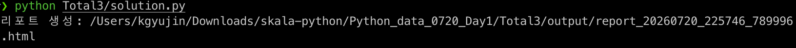
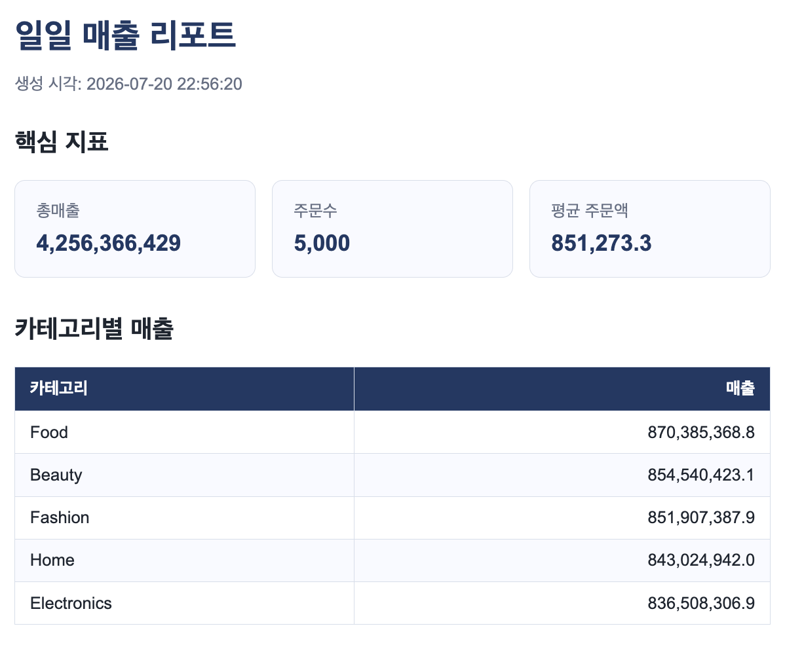

# 종합실습 3 회고

## 잘했다고 생각하는 점

설정은 `config.py`, 정제·집계·렌더링은 `report.py`, 실행과 스케줄링은 `solution.py`, 화면 구성은 Jinja2 템플릿으로 나눴다. `frozen=True` 설정을 사용했고, 단발 실행과 `--interval`, `--daily-at`, cron 호출이 모두 같은 `run_once()`를 거치도록 구성했다. 총매출, 주문 수, 평균 주문액과 카테고리별 매출이 HTML에 제대로 표시되는지 확인했으며, 파일명에 마이크로초까지 넣어 연속 실행해도 이전 리포트를 덮어쓰지 않게 했다.

## 아쉬운 점과 어려웠던 점

반복 실행은 끝나지 않는 프로그램이라 테스트 과정에서 안전하게 시작하고 종료하는 방법을 따로 마련해야 했다. 실행 방식이 세 가지여도 집계 결과는 같아야 하므로 공통 함수의 경계를 정하는 일도 생각보다 까다로웠다. 현재는 콘솔에 실행 결과를 출력하는 수준이라 운영 환경에서 필요한 구조화 로그, 오래된 리포트 정리, 장애 알림은 빠져 있다. 프로세스가 종료되면 경량 루프와 `schedule`도 멈추므로 실제 운영에서는 cron 같은 OS 스케줄러가 더 적합하다.

## 느낀 점

자동화는 반복문을 추가하는 것으로 끝나지 않았다. 설정, 분석 로직, 화면, 실행 시점을 분리해야 한 부분을 고쳐도 다른 부분이 흔들리지 않았다. 타임스탬프가 붙은 리포트가 실행할 때마다 쌓이는 모습을 보면서 자동화에서는 결과뿐 아니라 실행 이력도 중요하다는 것을 알았다.

## 실행 화면

| 작업 내용 | 참조 이미지 |
| :--- | :--- |
| Jinja2 일일 매출 리포트 |  |
| KPI와 카테고리별 매출이 표시된 최종 리포트 |  |

[종합실습 3 추가 과제 회고 바로가기](../Advanced/README.md#종합실습-3-추가-과제)
